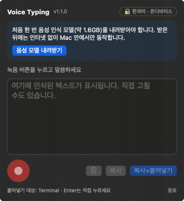
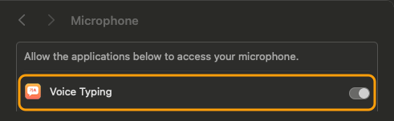
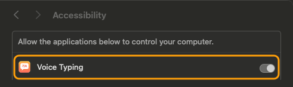
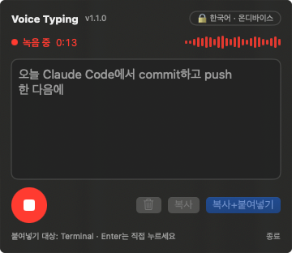
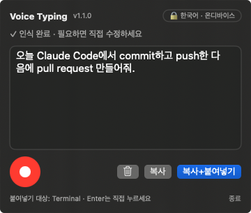
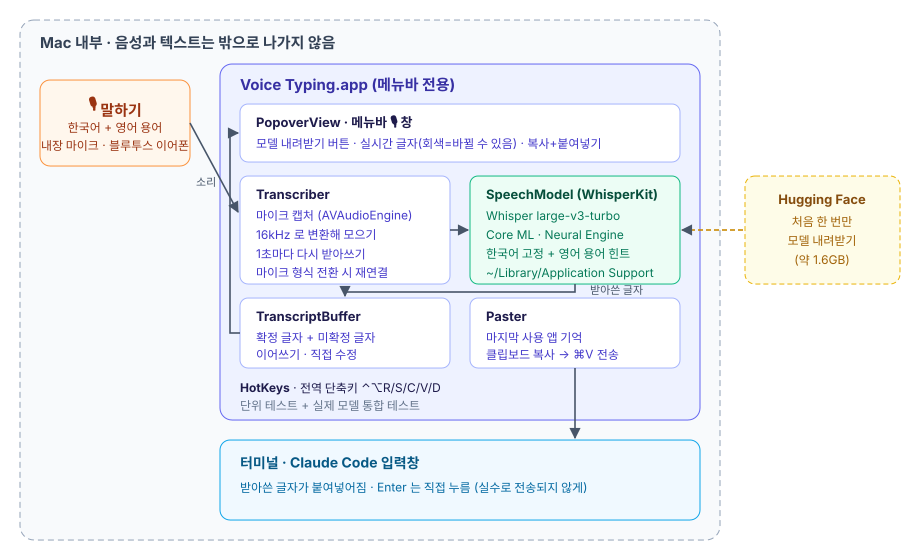

# Voice Typing

macOS 메뉴바에서 말하면 바로 글자로 바꿔 주는 앱입니다.

Claude Code 같은 터미널에 키보드 대신 말로 입력하려고 만들었습니다. 한국어 문장 속 영어 용어(commit, push, PR …)는 영어 철자로 받아 적습니다.

## 목차

1. [요약](#1-요약)
2. [설치](#2-설치)
3. [처음 설정 (한 번만)](#3-처음-설정-한-번만)
4. [사용법](#4-사용법)
5. [문제 해결](#5-문제-해결)
6. [구조](#6-구조)
7. [v1.0 → v1.1 변경점](#7-v10--v11-변경점)
8. [개발자용](#8-개발자용)
9. [삭제](#9-삭제)

## 1. 요약

| 항목 | 내용 |
|---|---|
| 쓰는 법 | 메뉴바 🎙 → 녹음 → 말하기 → 글자 확인 → [복사+붙여넣기] |
| 인식 엔진 | OpenAI Whisper large-v3-turbo ([WhisperKit](https://github.com/argmaxinc/WhisperKit), Core ML · Neural Engine) |
| 개인정보 | 소리와 글자는 **Mac 밖으로 나가지 않습니다.** 인터넷은 처음 모델을 받을 때만 씁니다. |
| 속도 | 말하는 동안 1~2초 늦게 글자가 따라옵니다 |
| 요구 사항 | macOS 14 이상, 메모리 8GB 이상 |

Siri나 macOS 받아쓰기(Dictation) 설정은 **필요 없습니다.** v1.0에서만 필요했습니다.

## 2. 설치

### 소스에서 설치 (이 저장소)

```bash
./install.sh
```

- 빌드 → `dist/VoiceTyping-<버전>.dmg` 생성 → `/Applications/Voice Typing.app` 설치 → 실행까지 한 번에 합니다.
- 실행 중이던 앱은 알아서 종료한 뒤 바꿔 설치합니다.

### dmg 파일로 설치

1. `VoiceTyping-1.1.0.dmg`를 엽니다.
2. `Voice Typing`을 `Applications` 폴더로 끌어다 놓습니다.
3. 다른 Mac에서 내려받은 dmg라 "확인되지 않은 개발자" 경고가 뜨면 `System Settings > Privacy & Security` 아래쪽의 **Open Anyway**를 누릅니다.
   - 이 앱은 개인용 ad-hoc 서명이라 그렇습니다.

설치하면 메뉴바에 🎙 아이콘이 생깁니다. Dock에는 나타나지 않습니다.

## 3. 처음 설정 (한 번만)

### ① 음성 모델 내려받기 (약 1.6GB)

메뉴바 🎙를 누르면 창 위쪽에 안내가 보입니다. **[음성 모델 내려받기]** 를 누릅니다.



- 회선 속도에 따라 수 분에서 수십 분 걸립니다.
- 받는 동안 진행률(%)이 보입니다. 끊기면 [다시 내려받기]를 누르세요. 받아 둔 파일은 다시 받지 않습니다.
- 다 받으면 "음성 모델 준비 중…"이 잠시 보입니다. 처음 한 번은 **20~30초**, 그 뒤로는 앱을 켤 때마다 몇 초면 됩니다.
- 모델은 `~/Library/Application Support/VoiceTyping` 에 저장됩니다.

모델이 준비되기 전에는 녹음 버튼이 회색으로 잠겨 있습니다.

### ② 마이크 권한

처음 녹음 버튼을 누르면 "Voice Typing이(가) 마이크에 접근하려고 합니다" 창이 뜹니다. **허용**을 누릅니다.

실수로 거부했다면 `System Settings > Privacy & Security > Microphone` 에서 **Voice Typing** 을 켭니다.



### ③ 손쉬운 사용 권한 (자동 붙여넣기용)

[복사+붙여넣기]는 대상 앱에 ⌘V를 대신 눌러 줍니다. 이를 위해 손쉬운 사용 권한이 필요합니다.

처음 [복사+붙여넣기]를 누르면 권한 요청이 뜹니다. `System Settings > Privacy & Security > Accessibility` 에서 **Voice Typing** 을 켭니다.



권한이 없어도 쓸 수는 있습니다. 클립보드에 복사만 되므로 ⌘V를 직접 누르면 됩니다.

## 4. 사용법

1. 글자를 넣을 앱(터미널의 Claude Code 등)을 한 번 클릭해 둡니다.
2. 메뉴바 🎙 → 빨간 **● 녹음** 버튼을 누릅니다. "마이크 연결 중…"이 **빨간 "녹음 중"으로 바뀌면** 말합니다.
   - 블루투스 이어폰(AirPods 등)은 마이크 모드로 바뀌는 데 1초 남짓 걸립니다. 그 전에 한 말은 녹음되지 않습니다.
   - 글자가 1~2초 늦게 따라옵니다. **회색 글자**는 아직 바뀔 수 있는 부분입니다.

   

3. **■ 정지**를 누르면 녹음 전체를 한 번 더 받아써 확정합니다 ("마무리 중…").
4. 틀린 곳이 있으면 글자 칸에서 직접 고칩니다.
5. **[복사+붙여넣기]** 를 누르면 1번에서 클릭해 둔 앱에 글자가 들어갑니다.
   - **Enter는 직접 누르세요.** 실수로 명령이 실행되지 않도록 일부러 누르지 않습니다.

   

창 아래쪽의 "붙여넣기 대상"에서 글자가 들어갈 앱을 확인할 수 있습니다.

### 자주 쓰는 영어 용어가 한글로 나올 때

Whisper는 한국어 문장 속 영어 용어를 "커밋", "클로드 코드"처럼 한글로 적곤 합니다. 앱이 받아쓴 뒤 자주 쓰는 개발 용어를 영어 철자로 바꿉니다 (커밋 → commit, 클로드 코드 → Claude Code 등).

용어를 더하려면 `Sources/VoiceTyping/SpeechModel.swift` 의 `terms` 목록에 넣고 다시 설치합니다. "나머지"처럼 다른 낱말 속에 들어 있는 글자는 바꾸지 않습니다.

## 5. 문제 해결

| 증상 | 원인과 해결 |
|---|---|
| 녹음 버튼이 회색 | 음성 모델이 아직 준비되지 않았습니다. 창 위쪽 안내를 따르세요. |
| 모델 내려받기 실패 | 인터넷 연결을 확인하고 [다시 내려받기]를 누르세요. |
| 말해도 글자가 안 나옴 | 아래 로그에서 "최대 음량"을 보세요. 0.05보다 작으면 마이크 소리가 거의 안 들어온 것입니다. `System Settings > Sound > Input` 에서 입력 장치를 확인하세요. |
| 블루투스 이어폰으로 녹음을 시작한 직후 끊김 | 이어폰이 마이크 모드로 바뀌며 형식이 바뀌는 현상입니다. 앱이 자동으로 다시 연결합니다 (최대 3번). |
| 붙여넣기가 안 되고 복사만 됨 | 손쉬운 사용 권한을 확인하세요. 앱을 다시 설치하면 서명이 바뀌어 권한을 껐다 다시 켜야 할 수 있습니다. |
| 무음인데 엉뚱한 글자가 나옴 | Whisper가 무음에서 말을 지어내는 현상입니다. 거의 무음인 녹음은 받아쓰지 않도록 막아 두었습니다. |

진단 로그는 아래 명령으로 볼 수 있습니다. 받아쓴 **내용은 기록하지 않고** 길이·음량·형식만 남깁니다.

```bash
/usr/bin/log show --last 10m --predicate 'subsystem == "local.voicetyping"'
```

## 6. 구조



| 구성 요소 | 하는 일 |
|---|---|
| `PopoverView` | 메뉴바 창. 모델 내려받기, 녹음 버튼, 실시간 글자, 복사·붙여넣기 |
| `Transcriber` | 마이크 소리를 16kHz로 바꿔 모으고 1초마다 받아쓰기. 마이크 형식이 바뀌면 다시 연결 |
| `SpeechModel` | Whisper 모델 내려받기·불러오기·받아쓰기 (WhisperKit) |
| `TranscriptBuffer` | 확정 글자와 아직 바뀔 수 있는 글자를 합쳐 보여 줌 |
| `Paster` | 마지막으로 쓰던 앱을 기억했다가 클립보드 복사 후 ⌘V 전송 |

## 7. v1.0 → v1.1 변경점

| 항목 | v1.0 (변경 전) | v1.1 (개선안) |
|---|---|---|
| 인식 엔진 | macOS 내장 받아쓰기 (Apple Speech) | Whisper large-v3-turbo (WhisperKit) |
| 한영 혼용 | 영어 용어를 한글로 적거나 틀림 | 영어 용어를 영어 철자로 받아씀 |
| 실시간 표시 | 즉시 | 1~2초 늦게 |
| 사전 설정 | Siri·받아쓰기 켜기, 한국어 받아쓰기 모델 설치 | 앱에서 모델 한 번 내려받기 |
| 외부 전송 | 없음 | 없음 (모델 다운로드만 인터넷 사용) |
| 설치 파일 | dmg 0.7MB | dmg 1.6MB + 모델 1.6GB (처음 한 번) |

v1.0으로 되돌리려면 `dist/VoiceTyping-1.0.0.dmg` 로 다시 설치합니다.

## 8. 개발자용

Xcode 없이 Command Line Tools만으로 빌드됩니다.

| 명령 | 하는 일 |
|---|---|
| `swift test` | 단위 테스트 (모델 없이, 1초 이내) |
| `VOICETYPING_MODEL_BASE="$HOME/Library/Application Support/VoiceTyping" swift test --filter SpeechModelTests` | 실제 모델로 한영 혼용 받아쓰기 통합 테스트 |
| `./build.sh` | `build/Voice Typing.app` 과 `dist/VoiceTyping-<버전>.dmg` 생성. `--open` 을 붙이면 바로 실행 |
| `./install.sh [dmg]` | dmg 를 `/Applications` 에 설치하고 실행. dmg 를 안 주면 빌드부터 |
| `README_SCREENSHOTS_DIR=docs/assets/readme VOICETYPING_MODEL_BASE="$HOME/Library/Application Support/VoiceTyping" swift test --filter ReadmeScreenshots` | README 앱 화면 이미지(01~03)를 실제 화면 코드로 다시 그림. 창을 띄우지 않음 |

- **버전:** `VERSION` 파일(예: `1.1.0`)이 기준입니다. 고치고 다시 빌드하면 앱 창 제목 옆 버전과 dmg 이름에 반영됩니다.
- **서명:** 기본은 ad-hoc 서명입니다. 개발자 인증서가 있으면 `VOICETYPING_SIGN_ID="Developer ID Application: …" ./build.sh`.
- **설계 문서:** `docs/` (설계안, 구현 계획, 질의응답 기록 `docs/history/`)

## 9. 삭제

1. 메뉴바 🎙 → **종료**
2. `/Applications/Voice Typing.app` 을 휴지통으로
3. 음성 모델(1.6GB): `~/Library/Application Support/VoiceTyping` 폴더 삭제
4. (선택) `System Settings > Privacy & Security` 의 Microphone · Accessibility 목록에서 Voice Typing 제거
