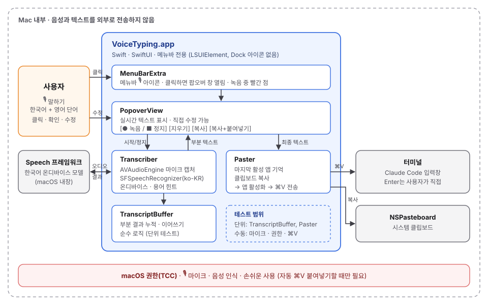
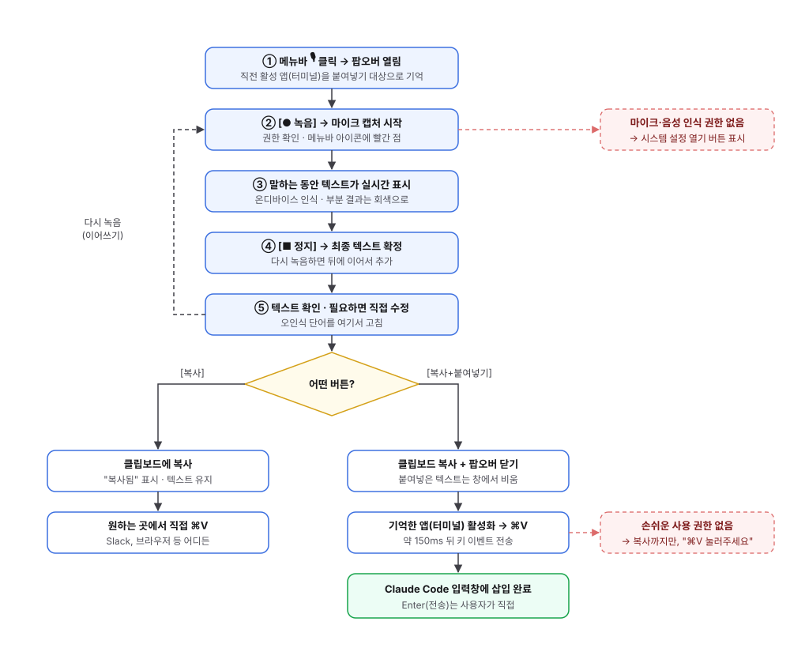

# Voice Typing: Claude Code용 음성 입력 메뉴바 앱 설계안

> 작성: 2026-10-06 11:43 KST · 작성: 개발팀
> 상태: **승인 (2026-10-06 14:48 KST)** · 구현 계획: `docs/261006-1448-VoiceTyping-구현계획.md`
> 앱 이름: 2026-10-06 보스 결정으로 가칭 VoiceType에서 **Voice Typing**으로 변경 (코드·파일 이름은 `VoiceTyping`)
> 샘플 UI: [`docs/mockup/voicetype-mockup.html`](mockup/voicetype-mockup.html) (`open docs/mockup/voicetype-mockup.html`)

---

## 목차

1. [요약](#1-요약)
2. [요구사항 정리](#2-요구사항-정리)
3. [변경 전과 개선안 비교](#3-변경-전과-개선안-비교)
4. [대안 검토: 꼭 새로 만들어야 하는가](#4-대안-검토-꼭-새로-만들어야-하는가)
5. [음성 인식 엔진 선택](#5-음성-인식-엔진-선택)
6. [아키텍처](#6-아키텍처)
7. [동작 흐름](#7-동작-흐름)
8. [UI 설계 (샘플 UI)](#8-ui-설계-샘플-ui)
9. [기술 상세](#9-기술-상세)
10. [테스트 전략](#10-테스트-전략)
11. [리스크와 대응](#11-리스크와-대응)
12. [구현 계획](#12-구현-계획)
13. [보스 확인 요청 사항](#13-보스-확인-요청-사항)
- [부록 A. 사전 검증 결과](#부록-a-사전-검증-결과)
- [부록 B. 팀 구성](#부록-b-팀-구성)

---

## 1. 요약

**무엇을 만드나**
메뉴바의 🎙 아이콘을 누르면 작은 창이 열리고, [녹음]을 누른 뒤 말하면 한국어(영어 단어 섞임) 텍스트가 실시간으로 창에 나타납니다.
[복사]를 누르면 클립보드에만 들어가고, [복사+붙여넣기]를 누르면 Claude Code 입력창에 바로 들어갑니다.

**핵심 결정**
- **엔진**: macOS 내장 Apple Speech 프레임워크 (`ko-KR`, 온디바이스). macOS 14 이상에서 지원됩니다.
- **보안**: 음성과 텍스트가 Mac 밖으로 나가지 않습니다. 인터넷 없이 동작하며 팀 규칙(외부 전송 금지)을 지킵니다.
- **영어 단어**: 한국어 인식기에 용어 힌트(`Claude Code`, `commit`, `API` 등)를 주어 보정합니다. 그래도 부족하면 로컬 Whisper(WhisperKit)로 교체합니다.
- **붙여넣기**: 클립보드에 넣은 뒤 ⌘V 키 이벤트를 보냅니다. 한글 입력기(IME)와 충돌하지 않는 방식입니다. **Enter는 자동으로 누르지 않습니다.**

**규모**
Swift 파일 3개와 테스트 파일 2개, 외부 라이브러리 0개입니다.
Xcode 없이 Command Line Tools + SwiftPM으로 빌드합니다(테스트 실행까지 검증 완료).
예상 기간은 MVP 기준 2~2.5일입니다.

**먼저 알려드릴 점**
Claude Code 에 내장 음성 입력 `/voice`가 있습니다.
다만 음성이 Anthropic 서버로 전송되고, 텍스트를 확인·수정하는 창이 없습니다. 자세한 비교는 [4장](#4-대안-검토-꼭-새로-만들어야-하는가)에 있습니다.

---

## 2. 요구사항 정리

### 보스께서 말씀하신 것

- 맥 메뉴바(status bar)에 상주하는 프로그램
- 버튼을 누르면 마이크로 입력을 받음
- 변환된 한국어(영어는 주로 단어 수준)가 바로 창에 표시됨
- 클립보드 복사, 붙여넣기 버튼

### 팀이 세운 가정 (틀린 것이 있으면 정정 부탁드립니다)

| # | 가정 | 근거 |
|---|------|------|
| 1 | 주 사용처는 터미널의 Claude Code 입력창 | 요청 내용 기준 |
| 2 | 붙여넣은 뒤 **전송(Enter)은 보스께서 직접** 누름 | 잘못 인식된 지시가 바로 실행되는 사고 방지 |
| 3 | 녹음은 버튼 토글 방식 (누르면 시작, 다시 누르면 정지) | 요청이 "버튼 누르면"이었음. 무음 자동 정지는 1차 범위에서 제외 |
| 4 | 개인용 1대에서만 사용 | 배포, 공증(notarization), 자동 업데이트 불필요 |
| 5 | 오프라인 동작, 음성 데이터 외부 전송 금지 | 팀 규칙: "프로젝트 데이터를 외부에 전송하지 않는다" |

### 성공 기준

- 한국어 문장에 영어 기술 용어가 섞인 발화가 **말하는 동안 실시간으로** 창에 표시된다.
- [복사+붙여넣기] **한 번**으로 Claude Code 입력창에 텍스트가 들어간다.
- **Wi-Fi를 끈 상태**에서도 동작한다.
- 아이콘 클릭부터 녹음 시작까지 체감 지연이 없다 (목표 0.5초 미만).

---

## 3. 변경 전과 개선안 비교

### 흐름 비교

```
변경 전:  생각 → 키보드 타이핑 (한/영 전환 반복, 오타 수정) → Enter

개선안:   생각 → 🎙 클릭 → [녹음] → 말하기 → 화면에서 확인·수정 → [복사+붙여넣기] → Enter
```

### 항목별 비교

| 항목 | 변경 전 (키보드) | 개선안 (Voice Typing) |
|------|------------------|--------------------|
| 입력 방식 | 직접 타이핑 | 말하기 + 화면 확인 |
| 한/영 전환 | `commit`, `API` 같은 단어마다 전환키 | 전환 없음 (인식기가 처리) |
| 긴 지시문 | 타이핑 시간이 길고 손목 부담 | 말하는 속도로 입력 (일반적으로 타이핑보다 빠름) |
| 오타·오인식 수정 | 터미널에서 커서 이동하며 수정 | 붙여넣기 **전에** 팝오버에서 수정 |
| 잘못된 지시 실행 위험 | 낮음 | 낮음 (Enter는 수동) |
| 개인정보 | 해당 없음 | 온디바이스 처리, 외부 전송 없음 |
| 필요한 권한 | 없음 | 마이크, 음성 인식, 손쉬운 사용(자동 붙여넣기 시) |

---

## 4. 대안 검토: 꼭 새로 만들어야 하는가

새로 만들지 않아도 되는 방법이 있다면 그쪽이 가장 저렴하므로 먼저 검토했습니다.

| 안 | 개발 비용 | 한국어 | 확인·수정 창 | 음성 처리 위치 | 판단 |
|----|-----------|--------|--------------|----------------|------|
| **A. macOS 기본 받아쓰기** (🎤 키 또는 Fn 두 번) | 0 | 지원 | 없음 (커서 위치에 바로 입력) | 온디바이스 | 지금 바로 써볼 수 있음. "확인창 + 버튼" 요구는 충족하지 못함 |
| **B. Claude Code `/voice`** (스페이스를 길게 눌러 말하기) | 0 | 미확인 | 없음 (입력창에 바로 삽입, tap 모드는 정지 시 자동 전송) | **Anthropic 서버**로 음성 스트리밍 | 외부 전송 금지 규칙과 충돌. 녹음 도구 SoX를 따로 설치해야 할 수 있음 |
| **C. 자체 메뉴바 앱** (본 설계) | 약 2~2.5일 | 지원 | **있음** | 온디바이스 | 요구사항을 모두 충족 → **추천** |

**팀 의견**
A는 5분이면 시험해 볼 수 있습니다. 써보시고 "이걸로 충분하다"고 판단되시면 개발하지 않는 것이 가장 좋습니다.
다만 말씀하신 "창에서 확인 후 버튼으로 복사/붙여넣기"는 A와 B 모두 제공하지 않으므로, 그 흐름이 필요하시면 C로 진행합니다.

---

## 5. 음성 인식 엔진 선택

| 엔진 | 장점 | 단점 | 판단 |
|------|------|------|------|
| **Apple Speech** (`SFSpeechRecognizer`, 온디바이스) | macOS 내장이라 의존성 0, 실시간 부분 결과, 자동 문장부호, `ko-KR` 온디바이스 지원 | 영어 단어가 한글 음차로 나올 수 있음 (예: "커밋") → 용어 힌트로 완화 | **1차 채택** |
| **WhisperKit** (로컬 Whisper, Core ML) | 한영 혼용 정확도가 높은 편, 로컬 처리 | 모델 다운로드 수백 MB~1GB 이상, 첫 로딩 지연, 외부 라이브러리 추가 | 정확도가 부족할 때 교체 후보 |
| 클라우드 API (OpenAI, Google 등) | 정확도 높음 | 음성이 외부로 전송됨 → 팀 규칙 위반, 사용료 | **제외** |
| `SpeechAnalyzer` (macOS 26 신규 API) | 장문 인식 개선 | macOS 15 이하에서는 사용 불가 | macOS 26 업그레이드 시 재검토 |

**영어 단어 처리 방법**
한국어 인식기의 `contextualStrings`에 자주 쓰는 용어를 등록합니다 (예: `Claude Code`, `commit`, `push`, `API`, `README`, `TypeScript`).
Phase 0에서 실제 문장 10개로 정확도를 측정한 뒤 엔진을 확정합니다.

---

## 6. 아키텍처



### 구성 요소

| 구성 요소 | 파일 | 역할 | 의존 |
|-----------|------|------|------|
| `MenuBarExtra` + `PopoverView` | `VoiceTypingApp.swift` | 메뉴바 아이콘, 팝오버 창, 버튼, 텍스트 편집 | SwiftUI |
| `Transcriber` | `Transcriber.swift` | 마이크 캡처, 온디바이스 인식, 부분 결과 전달 | AVFoundation, Speech |
| `TranscriptBuffer` | `Transcriber.swift` | 부분 결과 누적, 이어쓰기 (UI·OS와 무관한 순수 로직) | 없음 |
| `Paster` | `Paster.swift` | 마지막 활성 앱 기억, 클립보드 복사, 해당 앱에 ⌘V 전송 | AppKit, CoreGraphics |

**설계 원칙**
- 각 파일은 하나의 책임만 갖습니다. 화면(`VoiceTypingApp`), 인식(`Transcriber`), 출력(`Paster`)이 서로의 내부를 몰라도 됩니다.
- OS와 무관한 로직(`TranscriptBuffer`)과 클립보드 쓰기는 분리해 단위 테스트합니다.
- 엔진 교체 가능성을 위한 추상 인터페이스는 **미리 만들지 않습니다**. WhisperKit 교체가 확정되면 그때 `Transcriber` 내부만 바꿉니다.

---

## 7. 동작 흐름



1. **열기**: 메뉴바 🎙를 클릭하면 팝오버가 열립니다. 이 시점에 직전까지 쓰던 앱(터미널)을 붙여넣기 대상으로 기억합니다.
2. **녹음 시작**: [● 녹음]을 누르면 마이크 캡처가 시작되고, 메뉴바 아이콘에 빨간 점이 표시됩니다. 권한이 없으면 시스템 설정을 여는 버튼을 보여줍니다.
3. **실시간 표시**: 말하는 동안 인식 결과가 계속 갱신됩니다. 아직 확정되지 않은 부분은 회색으로 표시합니다.
4. **정지**: [■ 정지]를 누르면 최종 텍스트가 확정됩니다. 다시 녹음하면 기존 텍스트 뒤에 이어서 붙습니다.
5. **확인·수정**: 텍스트 영역에서 잘못 인식된 단어를 직접 고칩니다.
6. **보내기**
   - [복사]: 클립보드에만 넣고 창은 유지합니다. Slack, 브라우저 등 원하는 곳에 직접 ⌘V로 붙여넣을 수 있습니다.
   - [복사+붙여넣기]: 클립보드에 넣고 창을 닫은 뒤, 기억해 둔 앱을 활성화하고 약 150ms 후 ⌘V를 보냅니다. 보낸 텍스트는 창에서 비웁니다.
   - 손쉬운 사용 권한이 없으면 복사까지만 하고 "⌘V를 눌러 주세요"라고 안내합니다.

---

## 8. UI 설계 (샘플 UI)

**샘플 UI 파일**: [`docs/mockup/voicetype-mockup.html`](mockup/voicetype-mockup.html)
터미널에서 `open docs/mockup/voicetype-mockup.html`로 열 수 있습니다. 인터넷 연결이나 외부 리소스 없이 동작하며, 마이크를 쓰지 않는 시뮬레이션입니다.
상단의 "상태 미리보기" 버튼으로 대기, 녹음 중, 인식 완료, 권한 필요 화면과 라이트/다크 테마를 바로 전환해 보실 수 있습니다.

### 팝오버 화면 (텍스트 버전)

```
[대기]
  Voice Typing · 🔒 한국어·온디바이스
  녹음 버튼을 누르고 말씀하세요
  ┃ 여기에 인식된 텍스트가 표시됩니다
  (●)   [🗑] [복사] [복사+붙여넣기]
  붙여넣기 대상: Terminal · Enter는 직접

[녹음 중]  ← 메뉴바 아이콘에 빨간 점
  Voice Typing · 🔒 한국어·온디바이스
  ● 녹음 중 0:07   ▂▅▇▃▆▂▇▅▃
  ┃ 로그인 API 호출할 때 401 에러가 나는데   ← 마지막 단어는 회색(확정 전)
  (■)   [🗑] [복사] [복사+붙여넣기]          ← 녹음 중에는 복사 버튼 비활성

[인식 완료]
  ✓ 인식 완료 · 필요하면 직접 수정하세요
  ┃ 로그인 API 호출할 때 401 에러가 나는데 auth middleware 쪽 코드 확인해서 원인 찾아줘.
  (●)   [🗑] [복사] [복사+붙여넣기]          ← 다시 녹음하면 뒤에 이어쓰기

[권한 필요]
  ⚠ 마이크 · 음성 인식 권한이 필요합니다   [시스템 설정 열기]
  (●) 비활성
```

### UI 결정 사항

| 결정 | 이유 |
|------|------|
| 팝오버 너비 약 370px, Dock 아이콘 없음 | 메뉴바 앱의 일반적인 형태, 작업 화면을 가리지 않음 |
| 빨간 원형 녹음 버튼 하나로 시작/정지 토글 | 요청하신 "버튼 누르면"과 일치, 상태가 아이콘 모양(●/■)으로 보임 |
| 확정 전 글자는 회색 | 인식이 아직 바뀔 수 있다는 것을 표시 |
| 텍스트 영역 직접 편집 가능 | 오인식된 영어 단어를 붙여넣기 전에 고치기 위함 |
| "붙여넣기 대상: Terminal" 표시 | 어느 창에 들어갈지 미리 확인 |
| "🔒 한국어·온디바이스" 배지 | 외부 전송이 없다는 것을 화면에서 확인 |
| 라이트/다크 모드 모두 지원 | macOS 시스템 설정을 따름 |

---

## 9. 기술 상세

### 9.1 프로젝트 구조 (예정)

```
voice-typing/
├── Package.swift                 # SwiftPM, macOS 14+
├── Sources/VoiceTyping/
│   ├── VoiceTypingApp.swift        # MenuBarExtra + PopoverView
│   ├── Transcriber.swift         # AVAudioEngine + SFSpeechRecognizer + TranscriptBuffer
│   └── Paster.swift              # 마지막 활성 앱 추적, 클립보드, ⌘V
├── Tests/VoiceTypingTests/
│   ├── TranscriptBufferTests.swift
│   └── PasterTests.swift
├── Resources/Info.plist          # 권한 문구, LSUIElement
└── scripts/build-app.sh          # swift build → .app 번들 → 코드 서명
```

### 9.2 핵심 코드 스케치

아래는 설계 이해를 돕기 위한 요지이며, 실제 코드는 TDD로 작성합니다.

```swift
// Transcriber.swift: 온디바이스 한국어 인식
let recognizer = SFSpeechRecognizer(locale: Locale(identifier: "ko-KR"))!
let request = SFSpeechAudioBufferRecognitionRequest()
request.requiresOnDeviceRecognition = true   // 외부 전송 차단 (서버 인식으로 대체되지 않음)
request.shouldReportPartialResults = true    // 말하는 동안 실시간 표시
request.addsPunctuation = true               // 자동 문장부호
request.contextualStrings = ["Claude Code", "commit", "push", "API", "README"]

let input = engine.inputNode
input.installTap(onBus: 0, bufferSize: 1024, format: input.outputFormat(forBus: 0)) { buffer, _ in
    request.append(buffer)
}
try engine.start()
task = recognizer.recognitionTask(with: request) { result, _ in
    guard let result else { return }
    transcript.update(result.bestTranscription.formattedString, isFinal: result.isFinal)
}
```

```swift
// Paster.swift: 클립보드 복사 후 직전 앱에 ⌘V
func copyAndPaste(_ text: String, to app: NSRunningApplication?) -> Bool {
    let pb = NSPasteboard.general
    pb.clearContents()
    pb.setString(text, forType: .string)
    guard let app, AXIsProcessTrusted() else { return false }   // 권한 없으면 복사까지만
    app.activate()
    // ponytail: 고정 150ms 지연. 느리게 활성화되는 앱이 있으면 이 값만 조정
    DispatchQueue.main.asyncAfter(deadline: .now() + 0.15) {
        let src = CGEventSource(stateID: .combinedSessionState)
        for keyDown in [true, false] {
            let e = CGEvent(keyboardEventSource: src, virtualKey: 9 /* V */, keyDown: keyDown)
            e?.flags = .maskCommand
            e?.post(tap: .cghidEventTap)
        }
    }
    return true
}
```

**"직전 앱"을 기억하는 방법**
팝오버를 여는 순간 Voice Typing 자신이 활성 앱이 되므로, 그 시점에 `frontmostApplication`을 읽으면 자기 자신이 나옵니다.
그래서 `NSWorkspace.didActivateApplicationNotification`을 구독해 **자기 자신이 아닌 마지막 활성 앱**을 계속 기록합니다.

**키 입력 흉내 대신 ⌘V를 쓰는 이유**
글자를 한 자씩 키 이벤트로 보내면 한글 입력기 조합과 충돌해 자모가 깨질 수 있습니다.
클립보드 + ⌘V는 터미널의 붙여넣기 경로를 그대로 쓰므로 한글, 줄바꿈, 긴 텍스트 모두 안전합니다.

### 9.3 권한과 Info.plist

| 권한 | Info.plist 키 / API | 언제 필요 |
|------|---------------------|-----------|
| 마이크 | `NSMicrophoneUsageDescription` | 첫 녹음 시 1회 요청 |
| 음성 인식 | `NSSpeechRecognitionUsageDescription` | 첫 녹음 시 1회 요청 |
| 손쉬운 사용 | `AXIsProcessTrustedWithOptions` | [복사+붙여넣기]의 ⌘V 전송 시에만 |
| Dock 숨김 | `LSUIElement = true` | 항상 (메뉴바 전용 앱) |

### 9.4 Xcode 없이 빌드

Xcode 없이 Command Line Tools만으로 빌드할 수 있습니다.

```bash
swift build -c release
mkdir -p build/VoiceTyping.app/Contents/MacOS
cp .build/release/VoiceTyping build/VoiceTyping.app/Contents/MacOS/
cp Resources/Info.plist build/VoiceTyping.app/Contents/
codesign --force --sign - build/VoiceTyping.app    # 임시(ad-hoc) 서명
```

**주의할 점**
임시 서명은 빌드할 때마다 서명 값이 바뀌어서, 개발 중 재빌드하면 **손쉬운 사용 권한이 풀릴 수 있습니다**.
키체인 접근 앱에서 로컬 자체 서명 인증서를 하나 만들어 그 이름으로 서명하면 권한이 유지됩니다.

---

## 10. 테스트 전략

팀 규칙(TDD)에 따라 테스트를 먼저 작성합니다. Command Line Tools만으로 `swift test`(Swift Testing)가 동작하는 것을 확인했습니다.

### 단위 테스트 (`swift test`)

| 대상 | 검증 내용 |
|------|-----------|
| `TranscriptBuffer` | 부분 결과 갱신, 확정 처리, 다시 녹음 시 이어쓰기, 인식기가 중간에 결과를 초기화해도 앞 문장이 사라지지 않음 |
| `Paster` 복사 | 전용 이름의 `NSPasteboard`를 주입해 텍스트가 정확히 들어가는지 확인 (시스템 클립보드를 건드리지 않음) |

### 수동 QA 체크리스트

마이크, 권한 팝업, 다른 앱으로의 키 입력은 자동 테스트가 어려우므로 체크리스트로 확인합니다.

- [ ] 첫 실행 시 마이크·음성 인식 권한 요청이 뜬다
- [ ] 권한을 거부하면 "시스템 설정 열기" 안내가 나온다
- [ ] Wi-Fi를 끈 상태에서 인식된다
- [ ] 1분 이상 연속으로 말해도 끊기지 않는다
- [ ] 한영 혼용 문장 10개의 정확도를 기록한다 (Phase 0)
- [ ] Terminal, iTerm2, VS Code 터미널 등에서 [복사+붙여넣기]가 동작한다
- [ ] 손쉬운 사용 권한이 없으면 복사까지만 하고 안내한다
- [ ] 붙여넣은 뒤 Enter가 자동으로 눌리지 않는다

---

## 11. 리스크와 대응

| 리스크 | 영향 | 대응 |
|--------|------|------|
| 영어 단어가 한글 음차로 나옴 ("커밋", "에이피아이") | 중 | `contextualStrings` 용어 힌트 → 부족하면 치환 사전 또는 WhisperKit 교체 |
| 긴 침묵 후 인식기가 부분 결과를 초기화 (OS 버전별 보고 사례 있음) | 중 | `TranscriptBuffer`가 이전 결과를 누적 보관 (단위 테스트로 보장) |
| 서버 인식의 1분 제한 | 중 | `requiresOnDeviceRecognition = true`로 온디바이스만 사용 (Phase 0에서 실측) |
| 팝오버를 열면 자기 자신이 활성 앱이 되어 붙여넣기 대상을 잃음 | 중 | 활성화 알림으로 "자기 자신이 아닌 마지막 앱"을 추적 |
| 재빌드 시 손쉬운 사용 권한 해제 | 하 (개발 중 불편) | 로컬 자체 서명 인증서로 고정 서명 |
| ⌘V가 앱 활성화보다 먼저 도착 | 하 | 150ms 지연, 필요 시 상수만 조정 |
| 클립보드 기존 내용 덮어씀 | 하 | [복사] 버튼과 동일한 동작이므로 수용. 필요하시면 복원 옵션 추가 |

---

## 12. 구현 계획

| 단계 | 내용 | 기간 | 완료 확인 방법 |
|------|------|------|----------------|
| **Phase 0** 스파이크 | 실제 마이크로 한영 혼용 문장 10개 인식, 용어 힌트 효과와 1분 이상 발화 확인 | 0.5일 | 정확도 표 작성 → 엔진 확정 |
| **Phase 1** MVP | 메뉴바 아이콘, 팝오버, 녹음/정지, 실시간 표시, 편집, 지우기, [복사], [복사+붙여넣기], 권한 안내 | 1.5~2일 | `swift test` 전부 통과 + 수동 QA 체크리스트 전부 통과 |
| **Phase 2** (선택, 요청 시) | 전역 단축키(예: ⌥Space), 치환 사전, 최근 기록, WhisperKit 엔진, 로그인 시 자동 실행 | 항목별 0.5일 내외 | 항목별 테스트 |

Phase 2 항목은 요청하신 범위가 아니므로 **기본적으로 만들지 않습니다**. Phase 1을 써보신 뒤 필요한 것만 추가합니다.

---

## 13. 보스 확인 요청 사항

아래 5가지에 답해 주시면 Phase 0부터 착수하겠습니다. 답이 없는 항목은 **기본값**으로 진행합니다.

| # | 질문 | 기본값 |
|---|------|--------|
| 1 | A안(macOS 기본 받아쓰기)을 먼저 써보시겠습니까, 바로 C안(자체 앱)을 진행할까요? | 바로 C안 진행 |
| 2 | 앱 이름 | **Voice Typing (확정)** |
| 3 | [복사+붙여넣기] 후 Enter까지 자동으로 누를까요? | 누르지 않음 |
| 4 | 전역 단축키를 1차 범위에 넣을까요? | 넣지 않음 (메뉴바 클릭만) |
| 5 | 정확도가 부족하면 WhisperKit(모델 수백 MB~1GB 이상 로컬 다운로드)으로 바꿔도 될까요? | 교체 전에 다시 보고 |

---

## 부록 A. 사전 검증 결과

설계의 전제가 맞는지 직접 확인했습니다. 검증용 스크립트는 임시 폴더에서만 실행했습니다.

| 확인 항목 | 방법 | 결과 |
|-----------|------|------|
| 개발 환경 | `swift build` | macOS 14 이상, Command Line Tools만으로 빌드 가능 (Xcode 불필요) |
| 한국어 온디바이스 인식 | `SFSpeechRecognizer(locale: ko-KR).supportsOnDeviceRecognition` | `available: true`, `onDevice: true` |
| Xcode 없이 TDD 가능 여부 | 임시 SwiftPM 패키지에서 `swift test` (Swift Testing) | 통과 |
| Claude Code 내장 음성 | Claude Code 바이너리 문자열 검사 | `/voice` 존재: "hold space to speak", hold/tap 모드, 서버 `speech_to_text/voice_stream` 엔드포인트 사용 |
| SoX (녹음 도구) | `/voice` 사용 조건 확인 | 기본 macOS 에는 없어 따로 설치해야 함 |
| 샘플 UI 동작 | 헤드리스 브라우저로 상태별 스크린샷 | 대기/녹음/완료/권한/붙여넣기 정상, 폰 너비(390px)에서 가로 넘침 없음 |

---

## 부록 B. 팀 구성

`docs/.project/TEAM.md`, `docs/.project/PROJECT.md`가 아직 없어서 이번 설계는 기본 역할로 진행했습니다.

| 역할 | 담당 |
|------|------|
| 설계 / 아키텍처 | 요구사항 정리, 엔진 선택, 구조 설계 |
| macOS 개발 | Swift, SwiftUI, Speech, AppKit 구현 |
| QA | 단위 테스트, 수동 QA 체크리스트 |

두 파일을 만들어 두기를 원하시면 이 설계안 기준으로 초안을 작성하겠습니다.
